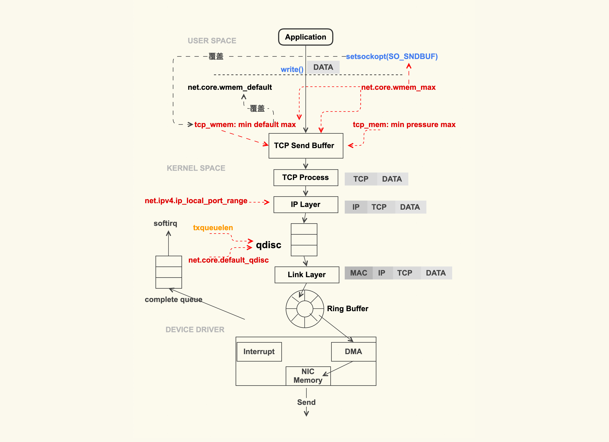
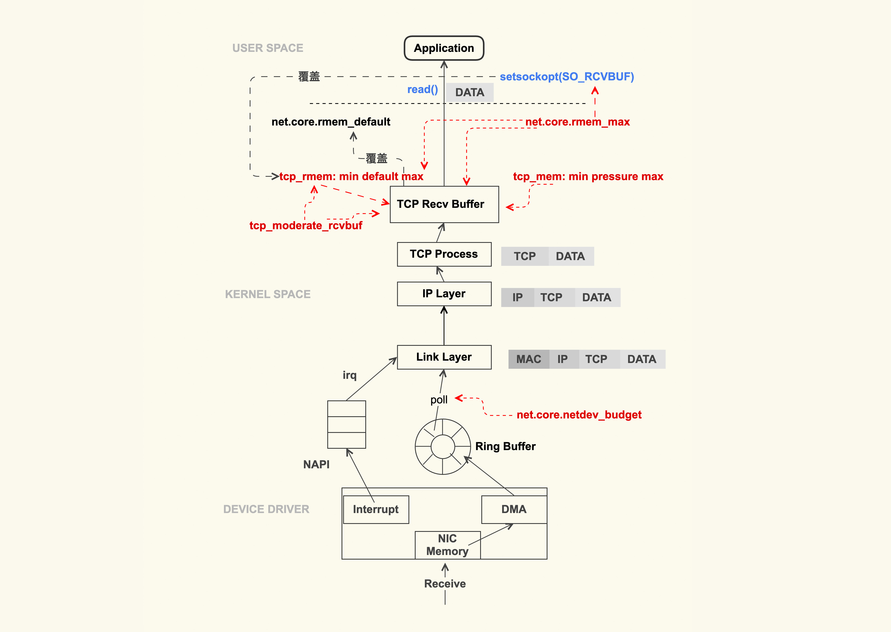
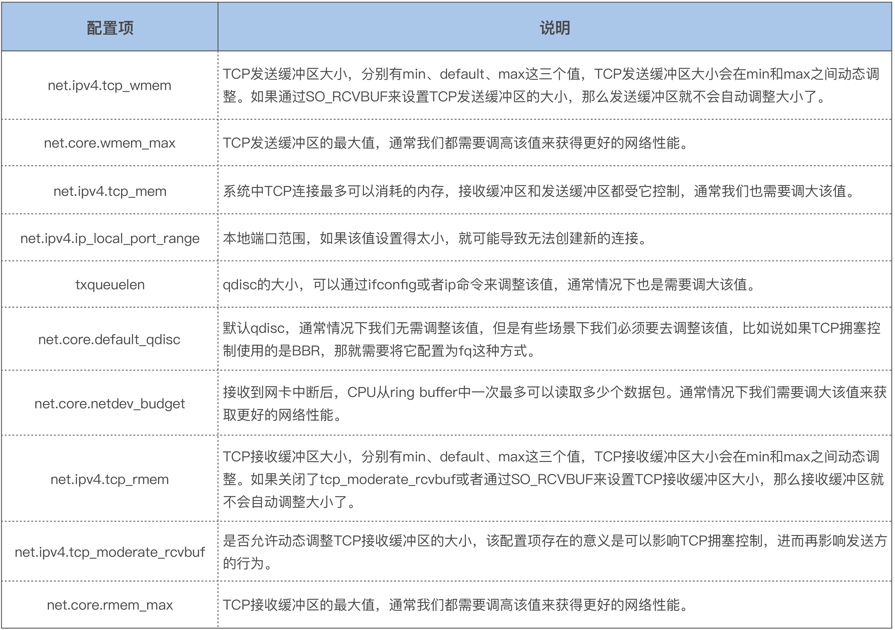

## TCP与性能相关参数

## 概述一、TCP 数据包的发送过程会受什么影响？




#### 二、TCP Send Buffer

应用程序调用 write(2) 或者 send(2) 系列系统调用开始往外发包时，这些系统调用会把数据包从用户缓冲区拷贝到 TCP 发送缓冲区（TCP Send Buffer），这个 TCP 发送缓冲区的大小是受限制的，参数是 net.ipv4.tcp_wmem 。

```
net.ipv4.tcp_wmem = 8192 65536 16777216
#net.ipv4.tcp_wmem = 4096	16384	4194304
```

1. tcp_wmem 中这三个数字的含义分别为 min、default、max。
2. TCP 发送缓冲区的大小会在 min 和 max 之间动态调整，==初始的大小是 default==
3. 这个动态调整的过程是由==内核自动==来做的，是为了在尽可能少的浪费内存的情况下来满足发包的需要，应用程序无法干预。
4. tcp_wmem 中的 max 不能超过 net.core.wmem_max 这个配置项的值，相冲突则以 net.core.wmem_max为准。通常情况下，我们需要设置 net.core.wmem_max 的值大于等于 net.ipv4.tcp_wmem 的 max
5. 通常情况下我们需要==调大==它们的默认值

##### 2.1 如果设置得不够

TCP 发送缓冲区太小，可能导致业务延迟很大，产生sk_stream_wait_memory事件

```
# sndbuf_overflow.stp
# Usage :
# $ stap sndbuf_overflow.stp
probe kernel.function("sk_stream_wait_memory")
{
    printf("%d %s TCP send buffer overflow\n",
         pid(), execname())
}
```

或者直接安装systemtap后，有sk_stream_wait_memory.stp脚本，在/usr/share/systemtap/examples/network/sk_stream_wait_memory.stp路径之下

或者使用bpftrace脚本观察sk_stream_wait_memory事件

```
# bpftrace -e "kprobe:sk_stream_wait_memory {@[comm]=count();}"
Attaching 1 probe...
^C
```

#### 三、setsockopt

如果应用程序有的时候会很明确地知道自己发送多大的数据，需要多大的 TCP 发送缓冲区，

1. 通过 setsockopt(2) 里的 ==SO_SNDBUF 来设置固定的缓冲区==大小。
2. 一旦进行了这种设置后，==tcp_wmem 就会失效==，内核也不会对它进行动态调整。
3. SO_SNDBUF 设置的==最大值==不能超过 net.core.wmem_max，如果超过了该值，内核会把它强制设置为 net.core.wmem_max
4. 通常情况下，我们都不会通过 SO_SNDBUF 来设置 TCP 发送缓冲区的大小，而是使用内核设置的 tcp_wmem

#### 四、tcp_mem （TCP 连接消耗的总内存）

tcp_wmem 以及 wmem_max 的大小设置都是针对单个 TCP 连接的，单位是Byte（字节）

```
net.ipv4.tcp_mem = 8388608 12582912 16777216
```

1. 它也有 3 个值：min、pressure、max
2. 单位是 Page（页数），也就是 4K。
3. 当所有 TCP 连接消耗的内存总和达到 max 后，也会因达到限制而无法再往外发包

##### 4.1 tcp_mem 达到限制而无法发包或者产生抖动

Linux 内核里面预置了静态观测点：sock_exceed_buf_limit

```
$ echo 1 > /sys/kernel/debug/tracing/events/sock/sock_exceed_buf_limit/enable
$ cat /sys/kernel/debug/tracing/trace_pipe
```

或者使用bpf

```
# bpftrace -e "t:sock:sock_exceed_buf_limit {@[comm]=count();}"
Attaching 1 probe...
^C
```

#### 五、ip_local_port_range

```
net.ipv4.ip_local_port_range
```

#### 六、qdisc

为了能够对 TCP/IP 数据流进行流控，Linux 内核在 IP 层实现了 qdisc（排队规则）。
我们平时用到的 TC 就是基于 qdisc 的流控工具。

1. qdisc 的队列长度是我们用 ifconfig 来看到的 txqueuelen

```	
$ ifconfig eth0 txqueuelen 2000
$ ip link set eth0 txqueuelen 2000
```
2. txqueuelen 太小导致数据包被丢弃的情况，通过下面这个命令来观察dropped是否为0

 ```	
$ ip -s -s link ls dev eth0
…
TX: bytes packets errors dropped carrier collsns3263284 25060 0 0 0 0
 ```
或者使用bpf工具tcpdrop来观察
3. inux 系统默认的 qdisc 为 pfifo_fast（先进先出），如果你想使用TCP BBR来改善 TCP 拥塞控制的话，那就需要将它调整为 fq（fair queue, 公平队列）：
```
net.core.default_qdisc = fq
```


## 概述七、TCP 数据包的接收过程会受什么影响？



#### 八、poll

数据包到达网卡后，就会==触发中断（IRQ）==来告诉 CPU 读取这个数据包。但是在高性能网络场景下，数据包的数量会非常大，如果每来一个数据包都要产生一个中断，那 CPU 的处理效率就会大打折扣，所以就产生了 NAPI（New API）这种机制让 CPU 一次性地去轮询（poll）多个数据包，以批量处理的方式来提升效率，降低网卡中断带来的性能开销。

那在 poll 的过程中，一次可以 poll 多少个呢？这个 poll 的个数可以通过 sysctl 选项来控制：

```
net.core.netdev_budget = 600			//默认为300
```

==net.core.netdev_budget_usecs是指接收软中断最大占用CPU时间==

#### 九、接收缓冲区

TCP 接收缓冲区的大小受 tcp_rmem 来控制
```
net.core.tcp_rmem = 600			//默认为300
```
1. 它也有 3 个字段：min、default、max。
2. TCP 接收缓冲区大小也是在 min 和 max 之间动态调整 ，是否动态调整是可以通过tcp_moderate_rcvbuf控制选项来关闭的，默认是打开

```
net.ipv4.tcp_moderate_rcvbuf = 1
```

#### 十、SO_RCVBUF

tcp_moderate_rcvbuf 可以控制 TCP 接收缓冲区的动态调节外，也可以通过 setsockopt() 中的配置选项 SO_RCVBUF 来控制

应用程序设置了 SO_RCVBUF 这个标记，那么 TCP 接收缓冲区的动态调整就是关闭

SO_RCVBUF 设置的值最大也不能超过 net.core.rmem_max


## 十一、总结




《Linux内核技术实战课》

https://cloud.tencent.com/developer/article/1580318


