## 网络丢包排查全攻略

针对⽹络丢包，本⽂提供⼀些常见的丢包故障定位⽅法，希望能够帮助⼤家对⽹络丢包有更多的认识，遇到丢包莫要慌，且跟着⼀起来涨姿(知)势(识)···

## 什么是丢包

数据在Internet上是以数据包为单位传输的，单位为字节，数据在⽹络上传输，受⽹络设备，⽹络质量等原因的影响，使得接收到的数据⼩于发送出去的数据，造成丢包。

## 数据包接收、发送原理

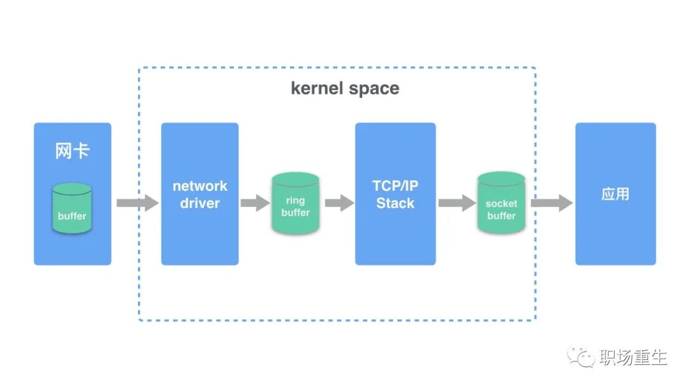

发送数据包：

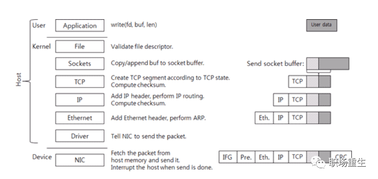

1.应⽤程序的数据包，在TCP层增加TCP报⽂头，形成可传输的数据包。
2.在IP层增加IP报头，形成IP报⽂。
3.经过数据⽹卡驱动程序将IP包再添加14字节的MAC头，构成frame（暂⽆CRC），frame（暂⽆CRC）中含有发送端和接收端的MAC地址。
4.驱动程序将frame（暂⽆CRC）拷贝到⽹卡的缓冲区，由⽹卡处理。
5.⽹卡为frame（暂⽆CRC）添加头部同步信息和CRC校验，将其封装为可以发送的packet，然后再发送到⽹线上，这样说就完成了⼀个IP报⽂的发送了，所有连接到这个⽹线上的⽹卡都可以看到该packet。

接收数据包：

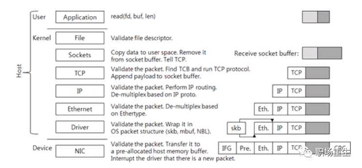

1.⽹卡收到⽹线上的packet，⾸先检查packet的CRC校验，保证完整性，然后将packet头去掉，得到frame。（⽹卡会检查MAC包内的⽬的MAC地址是否和本⽹卡的MAC地址⼀样，不⼀样则会丢弃。）
2.⽹卡将frame拷贝到预分配的ring buffer缓冲。
3.⽹卡驱动程序通知内核处理，经过TCP/IP协议栈层层解码处理。
4.应⽤程序从socket buffer 中读取数据

## 核心思路

了解了收发包的原理，可以了解到丢包原因主要会涉及⽹卡设备、⽹卡驱动、内核协议栈三⼤类。以下我们将遵循“从下到上分层分析（各层可能性出现的丢包场景），然后查看关键信息，最终得出分析结果”的原则展开介绍。

## 网络丢包情形概览

> 1.硬件网卡丢包

> 2.网卡驱动丢包

> 3.以太网链路层丢包

> 4.网络IP层丢包

> 5.传输层UDP/TCP丢包

> 6.应用层socket丢包

针对以上6种情形，分别作出如下详述

## 1.硬件网卡丢包

### 1.1 Ring Buffer溢出


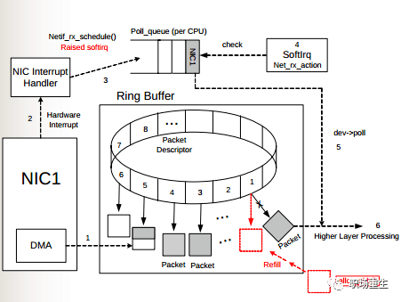


如图所示，物理介质上的数据帧到达后首先由NIC（网络适配器）读取，写入设备内部缓冲区Ring Buffer中，再由中断处理程序触发Softirq从中消费，Ring Buffer的大小因网卡设备而异。当网络数据包到达（生产）的速率快于内核处理（消费）的速率时，Ring Buffer很快会被填满，新来的数据包将被丢弃；

查看：

通过ethtool或/proc/net/dev可以查看因Ring Buffer满而丢弃的包统计，在统计项中以fifo标识：

```
$ ethtool -S eth0|grep rx_fifo
rx_fifo_errors: 0
$ cat /proc/net/dev
Inter-|Receive | Transmitface |bytes packets errs drop fifo frame compressed multicast|bytes packets errs drop fifo colls carrier compressedeth0: 17253386680731 42839525880 0 0 0 0 0 244182022 14879545018057 41657801805 0 0 0 0 0 0
```

\# 查看eth0网卡Ring Buffer最大值和当前设置

```
$ ethtool -g eth0
```

解决方案：修改网卡eth0接收与发送硬件缓存区大小

```
$ ethtool -G eth0 rx 4096 tx 4096
```

### 1.2 网卡端口协商丢包

1.  查看网卡丢包统计：ethtool -S eth1/eth0

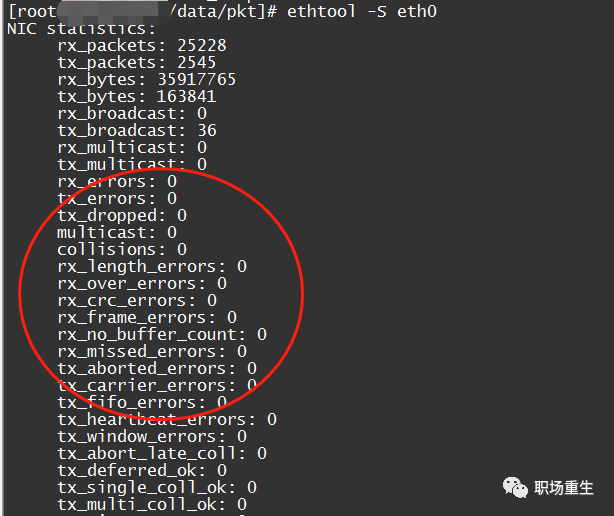

2.查看网卡配置状态：ethtool eth1/eth0

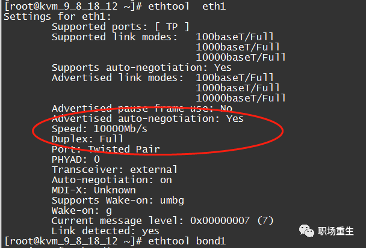

主要查看网卡和上游网络设备协商速率和模式是否符合预期；

解决方案：

1  重新自协商： ethtool -r  eth1/eth0;

2  如果上游不支持自协商，可以强制设置端口速率：

-   

```
ethtool -s eth1 speed 1000 duplex full autoneg off
```

------


### 1.3**网卡流控丢包**

\1. 查看流控统计：

```
ethtool -S eth1 | grep control
```


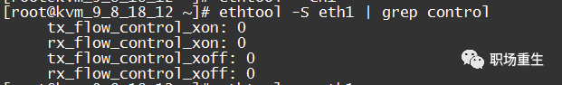

rx_flow_control_xon是在网卡的RX Buffer满或其他网卡内部的资源受限时，给交换机端口发送的开启流控的pause帧计数。对应的，tx_flow_control_xoff是在资源可用之后发送的关闭流控的pause帧计数。

2 .查看网络流控配置：ethtool -a eth1

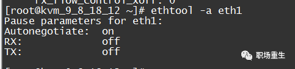

解决方案：关闭网卡流控

-   
-   
-   

```
ethtool -A ethx autoneg off //自协商关闭ethtool -A ethx tx off //发送模块关闭ethtool -A ethx rx off //接收模块关闭
```

------

### 

### ### 1.4**报文mac地址丢包** 

一般计算机网卡都工作在非混杂模式下，此时网卡只接受来自网络端口的目的地址指向自己的数据，如果报文的目的mac地址不是对端的接口的mac地址，一般都会丢包，一般这种情况很有可能是源端设置静态arp表项或者动态学习的arp表项没有及时更新，但目的端mac地址已发生变化（换了网卡），没有更新通知到源端（比如更新报文被丢失，中间交换机异常等情况）；

查看： 

1.目的端抓包，tcpdump可以开启混杂模式，可以抓到对应的报文，然后查看mac地址；

2.源端查看arp表或者抓包（上一跳设备），看发送的mac地址是否和下一跳目的端的mac地址一致；

解决方案：

1.刷新arp表然后发包触发arp重新学习（可能影响其他报文，增加延时，需要小心操作）；

2.可以在源端手动设置正确的静态的arp表项；


### 1.5***\*其他网卡异常丢包\****

这类异常比少见，但如果都不是上面哪些情况，但网卡统计里面任然有丢包计数，可以试着排查一下：

**网卡firmware版本:**

排查一下网卡phy芯片firmware是不是有bug，安装的版本是不是符合预期，查看 ethtool -i eth1:

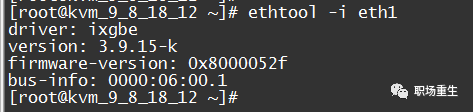

和厂家提case询问是不是已知问题，有没有新版本等；


**网线接触不良：**

如果网卡统计里面存在crc error 计数增长，很可能是网线接触不良，可以通知网管排查一下：

```
ethtool -S eth0
```

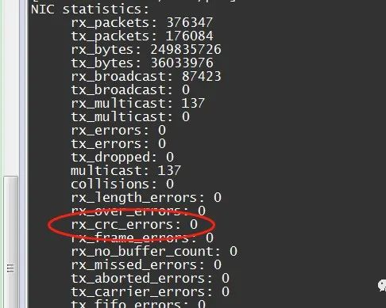

解决方案：一般试着重新插拔一下网线，或者换一根网线，排查插口是否符合端口规格等;


**报文长度丢包**

网卡有接收正确报文长度范围，一般正常以太网报文长度范围：64-1518，发送端正常情况会填充或者分片来适配，偶尔会发生一些异常情况导致发送报文不正常丢包；


查看：

```
ethtool -S eth1|grep length_errors
```

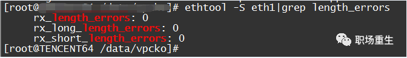

解决方案：

1  调整接口MTU配置，是否开启支持以太网巨帧；

2  发送端开启PATH MTU进行合理分片；

简单总结一下网卡丢包：


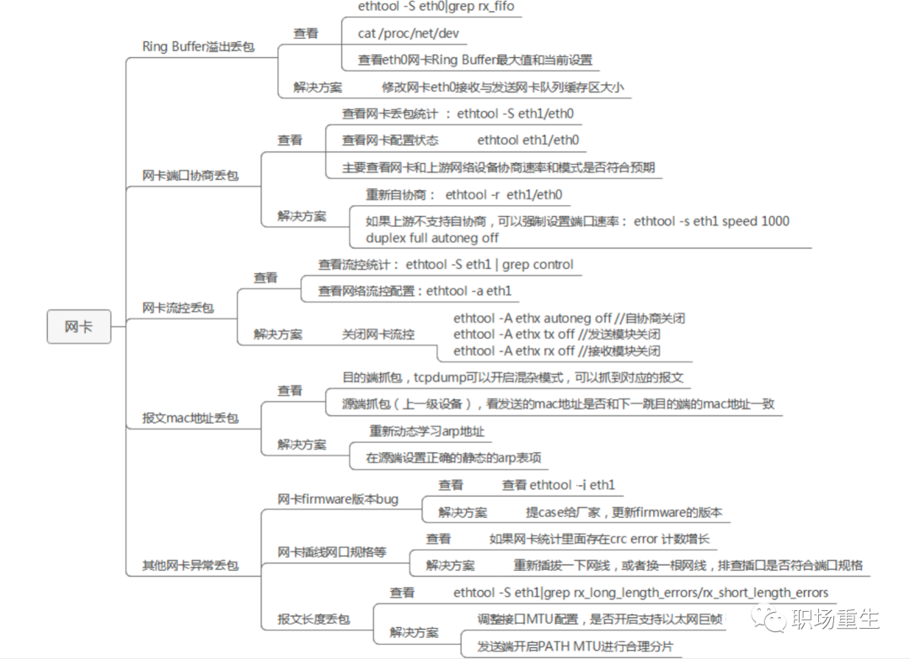

## 2. **网卡驱动丢包**

查看：ifconfig eth1/eth0 等接口

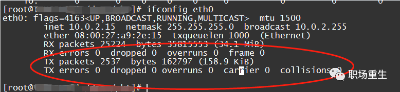
序号|列名|说明
---|---|---
1|RX errors|表示总的收包的错误数量，还包括too-long-frames错误，Ring Buffer 溢出错误，crc 校验错误，帧同步错误，fifo overruns 以及 missed pkg 等等。
2|RX dropped|表示数据包已经进入了 Ring Buffer，但是由于内存不够等系统原因，导致在拷贝到内存的过程中被丢弃。
3|RX overruns|表示了 fifo 的 overruns，这是由于 Ring Buffer(aka Driver Queue) 传输的 IO 大于 kernel 能够处理的 IO 导致的，而 Ring Buffer 则是指在发起 IRQ 请求之前的那块 buffer。很明显，overruns 的增大意味着数据包没到 Ring Buffer 就被网卡物理层给丢弃了，而 CPU 无法即使的处理中断是造成 Ring Buffer 满的原因之一，上面那台有问题的机器就是因为 interruprs 分布的不均匀(都压在 core0)，没有做 affinity 而造成的丢包。
4| RX frame|表示 misaligned 的 frames。
5|TX|对于 TX 的来说，出现上述 counter 增大的原因主要包括 aborted transmission, errors due to carrirer, fifo error, heartbeat erros 以及 windown error，而 collisions 则表示由于 CSMA/CD 造成的传输中断。

### 2.1 **驱动溢出丢包**

netdev_max_backlog是内核从NIC收到包后，交由协议栈（如IP、TCP）处理之前的缓冲队列。每个CPU核都有一个backlog队列，与Ring Buffer同理，当接收包的速率大于内核协议栈处理的速率时，CPU的backlog队列不断增长，当达到设定的netdev_max_backlog值时，数据包将被丢弃。

查看:

通过查看/proc/net/softnet_stat可以确定是否发生了netdev backlog队列溢出：

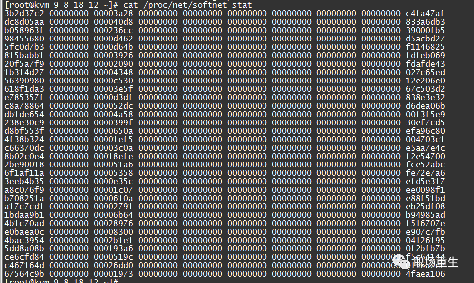


其中：每一行代表每个CPU核的状态统计，从CPU0依次往下；每一列代表一个CPU核的各项统计：第一列代表中断处理程序收到的包总数；第二列即代表由于netdev_max_backlog队列溢出而被丢弃的包总数。从上面的输出可以看出，这台服务器统计中，并没有因为netdev_max_backlog导致的丢包。

其含义如下：

1、每一行表示每个cpu的softnat_data统计数据；

2、第1列表示该cpu收到的包个数；

3、第2列表示因softnet_data的输入队列满而丢弃的数据包个数（input_pkt_queue，队列长度最大值可通过/proc/sys/net/core/netdev_max_backlog调整）；

4、第3列表示软中断一次取走netdev_budget个数据包，或取数据包时间超过2ms的次数；

5、第4~8列固定为0，没有意义；

6、第9列表示发送数据包时，对应的队列被锁住的次数；

7、表示开启rps时，该cpu向其它cpu发送的ipi中断个数；

解决方案：

netdev_max_backlog的默认值是1000，在高速链路上，可能会出现上述第二统计不为0的情况，可以通过修改内核参数net.core.netdev_max_backlog来解决：

```
$ sysctl -w net.core.netdev_max_backlog=2000
```


### 2.2 **单核负载高导致丢包**

单核CPU软中断占有高, 导致应用没有机会收发或者收包比较慢，即使调整netdev_max_backlog队列大小仍然会一段时间后丢包，处理速度跟不上网卡接收的速度;

查看：mpstat -P ALL 1

单核软中断占有100%，导致应用没有机会收发或者收包比较慢而丢包；

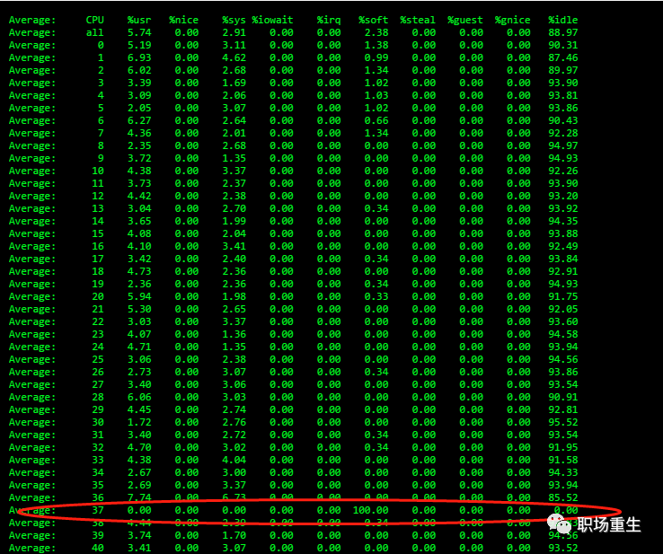

**解决方案**：

1.调整网卡RSS队列配置：

查看：ethtool -x ethx；

调整：ethtool -X ethx xxxx；

2.看一下网卡中断配置是否均衡 cat /proc/interrupts

调整：

```
1） irqbalance 调整；
# 查看当前运行情况service irqbalance status
# 终止服务service irqbalance stop
2） 中断绑CPU核 echo mask > /proc/irq/xxx/smp_affinity
```

3.根据CPU和网卡队列个数调整网卡多队列和RPS配置

-CPU大于网卡队列个数：

查看网卡队列 ethtool -x ethx；

协议栈开启RPS并设置RPS；

```
echo $mask（CPU配置）> /sys/class/net/$eth/queues/rx-$i/rps_cpusecho 4096（网卡buff）> /sys/class/net/$eth/queues/rx-$i/rps_flow_cnt2）CPU小于网卡队列个数，绑中断就可以，可以试着关闭RPS看一下效果：echo 0 > /sys/class/net/<dev>/queues/rx-<n>/rps_cpus
```

4.numa CPU调整，对齐网卡位置，可以提高内核处理速度，从而给更多CPU给应用收包，减缓丢包概率；

查看网卡numa位置：

```
ethtool -i eth1|grep bus-infolspci -s bus-info -vv|grep node
```

上面中断和RPS设置里面mask需要重新按numa CPU分配重新设置;

5.可以试着开启中断聚合（看网卡是否支持）

查看 : 

```
 ethtool -c ethxCoalesce parameters for eth1:Adaptive RX: on  TX: onstats-block-usecs: 0sample-interval: 0pkt-rate-low: 0pkt-rate-high: 0
rx-usecs: 25rx-frames: 0rx-usecs-irq: 0rx-frames-irq: 256
tx-usecs: 25tx-frames: 0tx-usecs-irq: 0tx-frames-irq: 256
rx-usecs-low: 0rx-frame-low: 0tx-usecs-low: 0tx-frame-low: 0
rx-usecs-high: 0rx-frame-high: 0tx-usecs-high: 0tx-frame-high: 0
```

调整：

```
ethtool -C ethx adaptive-rx on
```

## 3.**内核协议栈丢包**

### 3.1**以太网链路层丢包**

**neighbor系统arp丢包**

**arp_ignore配置丢包**

arp_ignore参数的作用是控制系统在收到外部的arp请求时，是否要返回arp响应。arp_ignore参数常用的取值主要有0，1，2，3~8较少用到；

查看：sysctl -a|grep arp_ignore

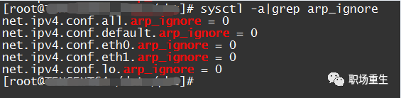

**解决方案**：根据实际场景设置对应值；

0：响应任意网卡上接收到的对本机IP地址的arp请求（包括环回网卡上的地址），而不管该目的IP是否在接收网卡上。

1：只响应目的IP地址为接收网卡上的本地地址的arp请求。

2：只响应目的IP地址为接收网卡上的本地地址的arp请求，并且arp请求的源IP必须和接收网卡同网段。

3：如果ARP请求数据包所请求的IP地址对应的本地地址其作用域（scope）为主机（host），则不回应ARP响应数据包，如果作用域为全局（global）或链路（link），则回应ARP响应数据包。

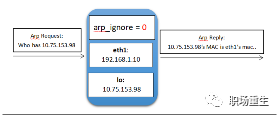

***\*arp_filter配置丢包\****

在多接口系统里面（比如腾讯云的弹性网卡场景），这些接口都可以回应arp请求，导致对端有可能学到不同的mac地址，后续报文发送可能由于mac地址和接收报文接口mac地址不一样而导致丢包，arp_filter主要是用来适配这种场景；

查看：

```
sysctl -a | grep arp_filter
```

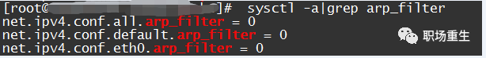


解决方案： 

```
根据实际场景设置对应的值，一般默认是关掉此过滤规则，特殊情况可以打开；
0：默认值，表示回应arp请求的时候不检查接口情况；
1：表示回应arp请求时会检查接口是否和接收请求接口一致，不一致就不回应；
```


**arp表满导致丢包**

比如下面这种情况，由于突发arp表项很多 超过协议栈默认配置，发送报文的时候部分arp创建失败，导致发送失败，从而丢包：

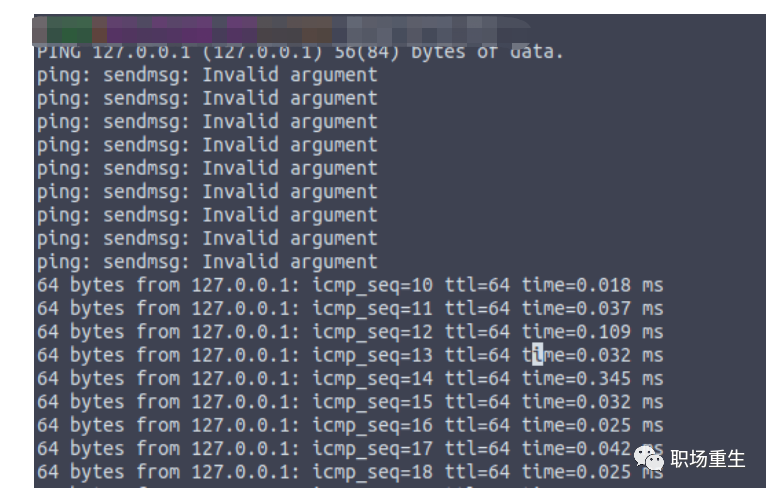


查看：

查看arp状态：cat /proc/net/stat/arp_cache ，table_fulls统计：

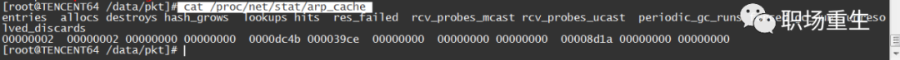

查看dmesg消息（内核打印）：

```
dmesg|grep neighbourneighbour: arp_cache: neighbor table overflow!
```

查看当前arp表大小：ip n|wc -l

查看系统配额：

```
sysctl -a |grep net.ipv4.neigh.default.gc_threshgc_thresh1：存在于ARP高速缓存中的最少层数，如果少于这个数，垃圾收集器将不会运行。缺省值是128。
gc_thresh2 ：保存在 ARP 高速缓存中的最多的记录软限制。垃圾收集器在开始收集前，允许记录数超过这个数字 5 秒。缺省值是 512。gc_thresh3 ：保存在 ARP 高速缓存中的最多记录的硬限制，一旦高速缓存中的数目高于此，垃圾收集器将马上运行。缺省值是1024。
```

一般在内存足够情况下，可以认为gc_thresh3 值是arp 表总大小；

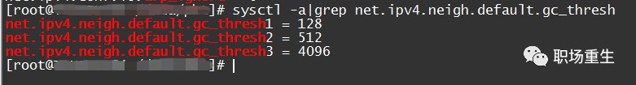

**解决方案**：根据实际arp最大值情况（比如访问其他子机最大个数），调整arp表大小

```
$ sudo sysctl -w net.ipv4.neigh.default.gc_thresh1=1024$ sudo sysctl -w net.ipv4.neigh.default.gc_thresh2=2048$ sudo sysctl -w net.ipv4.neigh.default.gc_thresh3=4096$ sudo sysctl  -p
```

**arp请求缓存队列溢出丢包**

查看：

```
cat /proc/net/stat/arp_cache ，unresolved_discards是否有新增计数
```

解决方案：根据客户需求调整缓存队列大小unres_qlen_bytes：

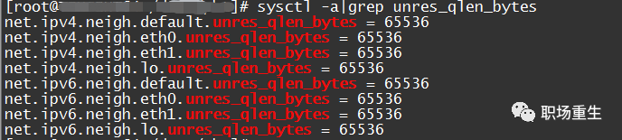

# 网络IP层丢包


### **接口ip地址配置丢包**

\1. 本机服务不通，检查lo接口有没有配置地址是127.0.0.1；

2 .本机接收失败， 查看local路由表：ip r show table local|grep 子机ip地址；这种丢包一般会出现在多IP场景，子机底层配置多ip失败，导致对应ip收不到包而丢包；

### **路由丢包**

***\*路由配置丢包\****

查看：

1.查看配置 路由是否设置正确（是否可达），是否配置策略路由（在弹性网卡场景会出现此配置）ip rule：
然后找到对应路由表。查看路由表：
或者直接用 ip r get x.x.x.x，让系统帮你查找是否存在可达路由，接口是否符合预期；
2.查看系统统计信息： 

```
netstat -s|grep "dropped because of missing route"
```

解决方案：重新配置正确的路由；

**反向路由过滤丢包**

反向路由过滤机制是Linux通过反向路由查询，检查收到的数据包源IP是否可路由（Loose mode）、是否最佳路由（Strict mode），如果没有通过验证，则丢弃数据包，设计的目的是防范IP地址欺骗攻击。

查看：

rp_filter提供三种模式供配置：

0 - 不验证

1 - RFC3704定义的严格模式：对每个收到的数据包，查询反向路由，如果数据包入口和反向路由出口不一致，则不通过

2 - RFC3704定义的松散模式：对每个收到的数据包，查询反向路由，如果任何接口都不可达，则不通过

查看当前rp_filter策略配置：


$cat /proc/sys/net/ipv4/conf/eth0/rp_filter

如果这里设置为1，就需要查看主机的网络环境和路由策略是否可能会导致客户端的入包无法通过反向路由验证了。

从原理来看这个机制工作在网络层，因此，如果客户端能够Ping通服务器，就能够排除这个因素了。

解决方案：

根据实际网络环境将rp_filter设置为0或2：

```
$ sysctl -w net.ipv4.conf.all.rp_filter=2
或
$ sysctl -w net.ipv4.conf.eth0.rp_filter=2
```

### **防火墙丢包**

**客户设置规则导致丢包**

查看：

```
  iptables -nvL |grep DROP ;
```

解决方案： 修改防火墙规则；

**连接跟踪导致丢包**

***\*连接跟踪表溢出丢包\****

kernel 用 ip_conntrack 模块来记录 iptables 网络包的状态，并把每条记录保存到 table 里（这个 table 在内存里，可以通过/proc/net/ip_conntrack 查看当前已经记录的总数），如果网络状况繁忙，比如高连接，高并发连接等会导致逐步占用这个 table 可用空间，一般这个 table 很大不容易占满并且可以自己清理，table 的记录会一直呆在 table 里占用空间直到源 IP 发一个 RST 包，但是如果出现被攻击、错误的网络配置、有问题的路由/路由器、有问题的网卡等情况的时候，就会导致源 IP 发的这个 RST 包收不到，这样就积累在 table 里，越积累越多直到占满。无论，哪种情况导致table变满，满了以后就会丢包，出现外部无法连接服务器的情况。内核会报如下错误信息：kernel: ip_conntrack: table full, dropping packet；

查看当前连接跟踪数 :

```
cat /proc/sys/net/netfilter/nf_conntrack_max
```

解决方案：

```
增大跟踪的最大条数net.netfilter.nf_conntrack_max  = 3276800减少跟踪连接的最大有效时间net.netfilter.nf_conntrack_tcp_timeout_established = 1200net.netfilter.nf_conntrack_udp_timeout_stream = 180net.netfilter.nf_conntrack_icmp_timeout = 30
```

------

**ct创建冲突失导致丢包**

查看：当前连接跟踪统计：cat /proc/net/stat/nf_conntrack，可以查各种ct异常丢包统计

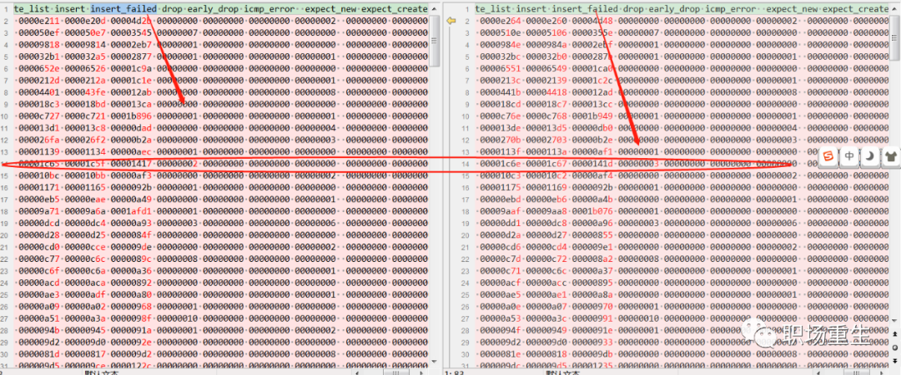


解决方案：内核热补丁修复或者更新内核版本（合入补丁修改）；


------


**传输层UDP/TCP丢包**


**tcp 连接跟踪安全检查丢包**

丢包原因：由于连接没有断开，但服务端或者client之前出现过发包异常等情况（报文没有经过连接跟踪模块更新窗口计数），没有更新合法的window范围，导致后续报文安全检查被丢包；协议栈用nf_conntrack_tcp_be_liberal 来控制这个选项：

1：关闭，只有不在tcp窗口内的rst包被标志为无效；

0：开启;  所有不在tcp窗口中的包都被标志为无效；

查看： 

查看配置 ：

```
sysctl -a|grep nf_conntrack_tcp_be_liberal 
net.netfilter.nf_conntrack_tcp_be_liberal = 1
```

查看log：

一般情况下netfiler模块默认没有加载log，需要手动加载;

```
modprobe ipt_LOG11sysctl -w net.netfilter.nf_log.2=ipt_LOG
```

然后发包后在查看syslog；

解决方案：根据实际抓包分析情况判断是不是此机制导致的丢包，可以试着关闭试一下；


### **分片重组丢包**

情况总结：**超时**

查看：

```
netstat -s|grep timeout601 fragments dropped after timeout
```

解决方法：调整超时时间

```
net.ipv4.ipfrag_time = 30sysctl -w net.ipv4.ipfrag_time=60
```

**frag_high_thresh, 分片的内存超过一定阈值会导致系统安全检查丢包**

查看：

```
netstat -s|grep reassembles8094 packet reassembles failed
```

解决方案：调整大小

```
net.ipv4.ipfrag_high_thresh net.ipv4.ipfrag_low_thresh
```

**分片安全距检查离丢包**

查看：

```
netstat -s|grep reassembles8094 packet reassembles failed
```

解决方案： 把ipfrag_max_dist设置为0，就关掉此安全检查

pfrag_max_dist特性，在一些场景下其实并不适用：

1.有大量的网络报文交互

2.发送端的并发度很高，同时SMP架构，导致很容易造成这种乱序情况；


**分片hash bucket冲突链太长超过系统默认值128**

查看： 

```
dmesg|grep “Dropping fragment”inet_frag_find: Fragment hash bucket 128 list length grew over limit. Dropping fragment.
```

解决方案：热补丁调整hash大小；


**系统内存不足，创建新分片队列失败**

查看方法：

```
netstat -s|grep reassembles8094 packet reassembles failed
```

dropwatch查看丢包位置 ：

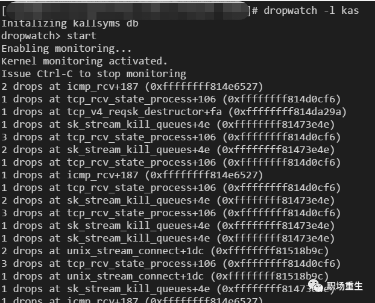

解决方案：

a.增大系统网络内存：

```
net.core.rmem_default net.core.rmem_max net.core.wmem_default
```

b.系统回收内存：

紧急情况下，可以用 `/proc/sys/vm/drop_caches`, 去释放一下虚拟内存；

```
To free pagecache:
# echo 1 > /proc/sys/vm/drop_caches
To free dentries and inodes:
# echo 2 > /proc/sys/vm/drop_caches
To free pagecache, dentries and inodes:
# echo 3 > /proc/sys/vm/drop_caches
```


### **MTU丢包**

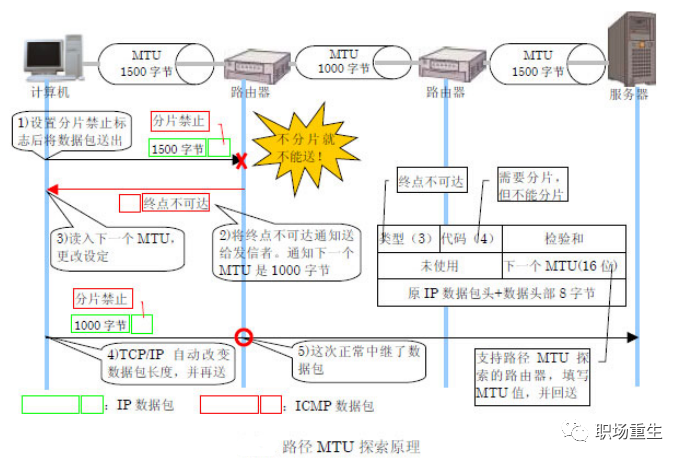


查看：

1.检查接口MTU配置，ifconfig eth1/eth0，默认是1500；

2.进行MTU探测，然后设置接口对应的MTU值；

解决方案：

\1. 根据实际情况，设置正确MTU值；

\2. 设置合理的tcp mss，启用TCP MTU Probe:

```
cat /proc/sys/net/ipv4/tcp_mtu_probing:
tcp_mtu_probing - INTEGER Controls TCP Packetization-Layer Path MTU Discovery.Takes three values:
0 - Disabled 
1 - Disabled by default, enabled when an ICMP black hole detected
2 - Always enabled, use initial MSS of tcp_base_mss.
```

# **tcp层丢包**

***\*TIME_WAIT过多丢包\****

大量TIMEWAIT出现，并且需要解决的场景，在高并发短连接的TCP服务器上，当服务器处理完请求后立刻按照主动正常关闭连接。。。这个场景下，会出现大量socket处于TIMEWAIT状态。如果客户端的并发量持续很高，此时部分客户端就会显示连接不上；

查看：

查看系统log ：

```
dmsgTCP: time wait bucket table overflow；
```

查看系统配置：

```
sysctl -a|grep tcp_max_tw_bucketsnet.ipv4.tcp_max_tw_buckets = 16384
```

解决方案：

\1. tw_reuse，tw_recycle 必须在客户端和服务端timestamps 开启时才管用（默认打开）

\2. tw_reuse 只对客户端起作用，开启后客户端在1s内回收；

\3. tw_recycle对客户端和服务器同时起作用，开启后在3.5*RTO 内回收，RTO 200ms~ 120s具体时间视网络状况。内网状况比tw_reuse稍快，公网尤其移动网络大多要比tw_reuse 慢，优点就是能够回收服务端的TIME_WAIT数量；

在服务端，如果网络路径会经过NAT节点，不要启用net.ipv4.tcp_tw_recycle，会导致时间戳混乱，引起其他丢包问题；

\4. 调整tcp_max_tw_buckets大小，如果内存足够：

```
sysctl -w net.ipv4.tcp_max_tw_buckets=163840；
```

**时间戳异常丢包**

当多个客户端处于同一个NAT环境时，同时访问服务器，不同客户端的时间可能不一致，此时服务端接收到同一个NAT发送的请求，就会出现时间戳错乱的现象，于是后面的数据包就被丢弃了，具体的表现通常是是客户端明明发送的SYN，但服务端就是不响应ACK。在服务器借助下面的命令可以来确认数据包是否有不断被丢弃的现象。

```
检查：
```

```
netstat -s | grep rejects
```

解决方案：

如果网络路径会经过NAT节点，不要启用net.ipv4.tcp_tw_recycle；


**TCP队列问题导致丢包**


**一个是半连接队列（syn queue）：**

在三次握手协议中，服务器维护一个半连接队列，该队列为每个客户端的SYN包开设一个条目(服务端在接收到SYN包的时候，就已经创建了request_sock结构，存储在半连接队列中)，该条目表明服务器已收到SYN包，并向客户发出确认，正在等待客户的确认包（会进行第二次握手发送SYN＋ACK的包加以确认）。这些条目所标识的连接在服务器处于Syn_RECV状态，当服务器收到客户的确认包时，删除该条目，服务器进入ESTABLISHED状态。该队列为SYN队列，长度为max(64,/proc/sys/net/ipv4/tcp_max_syn_backlog),  机器的tcp_max_syn_backlog值在/proc/sys/net/ipv4/tcp_max_syn_backlog下配置;


**一个是全连接队列（accept queue）：**

第三次握手时，当server接收到ACK 报之后， 会进入一个新的叫 accept 的队列，该队列的长度为 min(backlog, somaxconn)，默认情况下，somaxconn 的值为 128，表示最多有 129 的 ESTAB 的连接等待 accept()，而 backlog 的值则应该是由 int listen(int sockfd, int backlog) 中的第二个参数指定，listen 里面的 backlog 可以有我们的应用程序去定义的;


查看：

连接建立失败,syn丢包：

-   
-   

```
netstat -s |grep -i listenSYNs to LISTEN sockets dropped
```

也会受到连接满丢包影响

解决方案： 增加大小 tcp_max_syn_backlog

连接满丢包

-xxx times the listen queue of a socket overflowed

查看：

-   查看accept队列大小 ：net.core.somaxconn
-   ss -lnt查询socket队列 ：LISTEN 状态: Recv-Q 表示的当前等待服务端调用 accept 完成三次握手的 listen backlog 数值，也就是说，当客户端通过 connect() 去连接正在 listen() 的服务端时，这些连接会一直处于这个 queue 里面直到被服务端 accept()；Send-Q 表示的则是最大的 listen backlog 数值，这就就是上面提到的 min(backlog, somaxconn) 的值，
-   看一下是不是应用程序设置限制， int listen(int sockfd, int backlog)；

解决方案：

-    Linux内核参进行优化，可以缓解压力 tcp_abort_on_overflow=1

-    调整net.core.somaxconn大小;

-    应用程序设置问题，通知客户程序修改；

​    

***\**\*syn flood攻击丢包\*\**\*
**

 目前，Linux下默认会进行5次重发SYN-ACK包，重试的间隔时间从1s开始，下次的重试间隔时间是前一次的双倍，5次的重试时间间隔为1s, 2s, 4s, 8s, 16s，总共31s，第5次发出后还要等32s都知道第5次也超时了，所以，总共需要 1s + 2s + 4s+ 8s+ 16s + 32s = 63s，TCP才会把断开这个连接。由于，SYN超时需要63秒，那么就给攻击者一个攻击服务器的机会，攻击者在短时间内发送大量的SYN包给Server(俗称 SYN flood 攻击)，用于耗尽Server的SYN队列。对于应对SYN 过多的问题;

查看： 查看syslog： kernel: [3649830.269068] TCP: Possible SYN flooding on port xxx. Sending cookies. Check SNMP counters.

解决方案：

-   增大tcp_max_syn_backlog
-   减少tcp_synack_retries
-   启用tcp_syncookies
-   启用tcp_abort_on_overflow， tcp_abort_on_overflow修改成 1，1表示第三步的时候如果全连接队列满了，server发送一个reset包给client，表示废掉这个握手过程和这个连接（本来在server端这个连接就还没建立起来）；


***\**\*\*\*PAWS机制丢包\*\*\*\*\**
**

原理：PAWS(Protect Against Wrapped Sequence numbers)，高带宽下，TCP序列号可能在较短的时间内就被重复使用(recycle/wrapped)
就可能导致同一条TCP流在短时间内出现序号一样的两个合法的数据包及其确认包。

查看：


-   
-   
-   
-   
-   

```
$netstat -s |grep -e "passive connections rejected because of time stamp" -e "packets rejects in established connections because of timestamp” 387158 passive connections rejected because of time stamp825313 packets rejects in established connections because of timestamp
```

通过sysctl查看是否启用了tcp_tw_recycle及tcp_timestamp:

-   
-   
-   
-   

```
$ sysctl net.ipv4.tcp_tw_recyclenet.ipv4.tcp_tw_recycle = 1 $ sysctl net.ipv4.tcp_timestampsnet.ipv4.tcp_timestamps = 1
```


\1. tcp_tw_recycle参数。它用来快速回收TIME_WAIT连接，不过如果在NAT环境下会引发问题;

\2. 当多个客户端通过NAT方式联网并与服务端交互时，服务端看到的是同一个IP，也就是说对服务端而言这些客户端实际上等同于一个，可惜由于这些客户端的时间戳可能存在差异，于是乎从服务端的视角看，便可能出现时间戳错乱的现象，进而直接导致时间戳小的数据包被丢弃。如果发生了此类问题，具体的表现通常是是客户端明明发送的SYN，但服务端就是不响应ACK。

解决方案： 

在NAT环境下，清除tcp时间戳选项，或者不开启tcp_tw_recycle参数；


**TLP问题丢包**

TLP主要是为了解决尾丢包重传效率的问题，TLP能够有效的避免较长的RTO超时，进而提高TCP性能，详细参考文章：

http://perthcharles.github.io/2015/10/31/wiki-network-tcp-tlp/；

但在低时延场景下（短连接小包量），TLP与延迟ACK组合可能会造成无效重传，导致客户端感发现大量假重传包，加大了响应延迟；

查看：

查看协议栈统计：

```
netstat -s |grep TCPLossProbes
```

查看系统配置：

```
 sysctl -a | grep tcp_early_retrans
```

解决方案：

1.关掉延迟ack，打开快速ack；

2.linux实现nodelay语意不是快速ack，只是关闭nagle算法；

3.打开快速ack选项，socket里面有个 TCP_QUICKACK 选项， 需要每次recv后再设置一次。


**内存不足导致丢包**

查看：

查看log：

```
dmesg|grep “out of memory”
```

查看系统配置： 

```
cat /proc/sys/net/ipv4/tcp_memcat /proc/sys/net/ipv4/tcp_rmemcat /proc/sys/net/ipv4/tcp_wmem
```

解决方案：

根据TCP业务并发流量，调整系统参数，一般试着增大2倍或者其他倍数来看是否缓解；

```
sysclt -w net.ipv4.tcp_mem=sysclt -w net.ipv4.tcp_wmem=sysclt -w net.ipv4.tcp_rmem=sysctl -p
```

------


**TCP超时丢包**

查看：

抓包分析一下网络RTT：


解决方案：

-   关闭Nagle算法，减少小包延迟；
-   关闭延迟ack:

```
  sysctl -w net.ipv4.tcp_no_delay_ack=1
```


**TCP乱序丢包**

此时TCP会无法判断是数据包丢失还是乱序，因为丢包和乱序都会导致接收端收到次序混乱的数据包，造成接收端的数据空洞。TCP会将这种情况暂定为数据包的乱序，因为乱序是时间问题（可能是数据包的迟到），而丢包则意味着重传。当TCP意识到包出现乱序的情况时，会立即ACK，该ACK的TSER部分包含的TSEV值会记录当前接收端收到有序报文段的时刻。这会使得数据包的RTT样本值增大，进一步导致RTO时间延长。这对TCP来说无疑是有益的，因为TCP有充分的时间判断数据包到底是失序还是丢了来防止不必要的数据重传。当然严重的乱序则会让发送端以为是丢包一旦重复的ACK超过TCP的阈值，便会触发超时重传机制，以及时解决这种问题；详细请参考博客：

https://blog.csdn.net/dog250/article/details/78692585


查看：抓包分析是否存在很多乱序报文：

解决方案：如果在多径传输场景或者网络质量不好，可以通过修改下面值来提供系统对TCP无序传送的容错率：

### **拥塞控制丢包**

在互联网发展的过程当中，TCP算法也做出了一定改变，先后演进了

Reno、NewReno、Cubic和Vegas，这些改进算法大体可以分为基于丢包和基于延时的拥塞控制算法。基于丢包的拥塞控制算法以Reno、NewReno为代表，它的主要问题有Buffer bloat和长肥管道两种，基于丢包的协议拥塞控制机制是被动式的，其依据网络中的丢包事件来做网络拥塞判断。即使网络中的负载很高，只要没有产生拥塞丢包，协议就不会主动降低自己的发送速度。最初路由器转发出口的Buffer 是比较小的，TCP在利用时容易造成全局同步，降低带宽利用率，随后路由器厂家由于硬件成本下降不断地增加Buffer，基于丢包反馈的协议在不丢包的情况下持续占用路由器buffer，虽然提高了网络带宽的利用率，但同时也意味着发生拥塞丢包后，网络抖动性加大。另外对于带宽和RTT都很高的长肥管道问题来说，管道中随机丢包的可能性很大，TCP的默认buffer设置比较小加上随机丢包造成的cwnd经常下折，导致带宽利用率依旧很低； BBR（Bottleneck Bandwidth and Round-trip propagation time）是一种基于带宽和延迟反馈的拥塞控制算法。目前已经演化到第二版，是一个典型的封闭反馈系统，发送多少报文和用多快的速度发送这些报文都是在每次反馈中不断调节。在BBR提出之前，拥塞控制都是基于事件的算法，需要通过丢包或延时事件驱动；BBR提出之后，拥塞控制是基于反馈的自主自动控制算法，对于速率的控制是由算法决定，而不由网络事件决定，BBR算法的核心是找到最大带宽（Max BW）和最小延时（Min RTT）这两个参数，最大带宽和最小延时的乘积可以得到BDP(Bandwidth Delay Product), 而BDP就是网络链路中可以存放数据的最大容量。BDP驱动Probing State Machine得到Rate quantum和cwnd，分别设置到发送引擎中就可以解决发送速度和数据量的问题。


Linux 4.9内核首次采用BBR拥塞控制算法第一个版本，BBR抗丢包能力比其他算法要强，但这个版本在某些场景下面有问题（缺点），BBR在实时音视频领域存在的问题，深队列竞争不过Cubic。


问题现象就是：在深队列场景，BBR的ProbeRTT阶段只发4个包，发送速率下降太多会引发延迟加大和卡顿问题。

查看：

```
ss -sti //在源端 ss -sti|grep 10.125.42.49:47699 -A 3 （ 10.125.42.49:47699 是目的端地址和端口号）
```

解决方案：

-   ProbeRTT并不适用实时音视频领域，因此可以选择直接去除，或者像BBRV2把probe RTT缩短到2.5s一次，使用0.5xBDP发送；
-   如果没有特殊需求，切换成稳定的cubic算法；


# **UDP层丢包**

**收发包失败丢包**

查看：netstat 统计

如果有持续的 receive buffer errors/send buffer errors 计数；

解决方案：

1.  CPU负载（多核绑核配置），网络负载（软中断优化，调整驱动队列netdev_max_backlog），内存配置（协议栈内存）；
2.  按峰值在来，增大buffer缓存区大小：

```
net.ipv4.udp_mem = xxx
net.ipv4.udp_rmem_min = xxx
net.ipv4.udp_wmem_min = xxx
```

   \3. 调整应用设计：

-   UDP本身就是无连接不可靠的协议，适用于报文偶尔丢失也不影响程序状态的场景，比如视频、音频、游戏、监控等。对报文可靠性要求比较高的应用不要使用 UDP，推荐直接使用 TCP。当然，也可以在应用层做重试、去重保证可靠性
-   如果发现服务器丢包，首先通过监控查看系统负载是否过高，先想办法把负载降低再看丢包问题是否消失
-   如果系统负载过高，UDP丢包是没有有效解决方案的。如果是应用异常导致CPU、memory、IO 过高，请及时定位异常应用并修复；如果是资源不够，监控应该能及时发现并快速扩容
-   对于系统大量接收或者发送UDP报文的，可以通过调节系统和程序的 socket buffer size 来降低丢包的概率
-   应用程序在处理UDP报文时，要采用异步方式，在两次接收报文之间不要有太多的处理逻辑

# 应用层socket丢包


***\*socket缓存区接收丢包\****

查看： 

\1. 抓包分析是否存在丢包情况；

\2. 查看统计：

-   

```
netstat -s|grep "packet receive errors"
```

解决方案：

调整socket缓冲区大小：

```
socket配置（所有协议socket）：# Default Socket Receive Buffernet.core.rmem_default = 31457280# Maximum Socket Receive Buffernet.core.rmem_max = 67108864
```

具体大小调整原理：

缓冲区大小没有任何设置值是最佳的，因为最佳大小随具体情况而不同

缓冲区估算原理：在数据通信中，带宽时延乘积（英语：bandwidth-delay product；或称带宽延时乘积、带宽延时积等）指的是一个数据链路的能力（每秒比特）与来回通信延迟（单位秒）的乘积。[1][2]其结果是以比特（或字节）为单位的一个数据总量，等同在任何特定时间该网络线路上的最大数据量——已发送但尚未确认的数据。

**BDP = 带宽 \* RTT**

可以通过计算当面节点带宽和统计平均时延来估算BDP，即缓冲区的大小，可以参考下面常见场景估计：

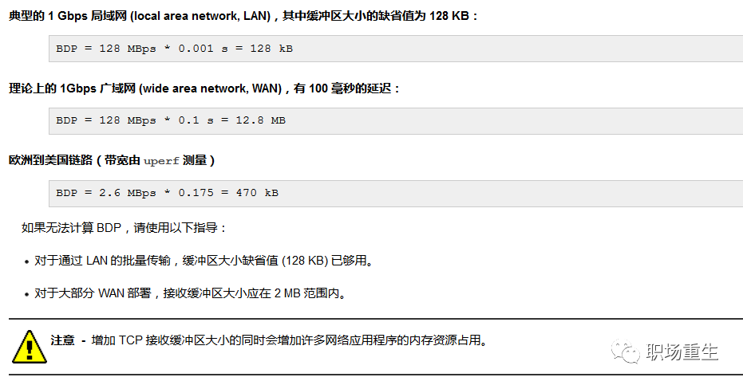

参考：https://docs.oracle.com/cd/E56344_01/html/E53803/gnkor.html


**应用设置tcp连接数大小丢包**

查看：

请参考上面TCP连接队列分析；

解决方案：

设置合理的连接队列大小，当第三次握手时，当server接收到ACK 报之后， 会进入一个新的叫 accept 的队列，该队列的长度为 min(backlog, somaxconn)，默认情况下，somaxconn 的值为 128，表示最多有 129 的 ESTAB 的连接等待 accept()，而 backlog 的值则应该是由 int listen(int sockfd, int backlog) 中的第二个参数指定，listen 里面的 backlog 可以有我们的应用程序去定义的；

**应用发送太快导致丢包**

查看统计：

```
 netstat -s|grep "send buffer errors
```

解决方案：

-   ICMP/UDP没有流控机制，需要应用设计合理发送方式和速度，照顾到底层buff大小和CPU负载以及网络带宽质量；
-    设置合理的sock缓冲区大小：

```
   setsockopt(s,SOL_SOCKET,SO_SNDBUF,  i(const char*)&nSendBuf,sizeof(int));
```

-   调整系统socket缓冲区大小：

```
   # Default Socket Send Buffer   
   net.core.wmem_default = 31457280   
   # Maximum Socket Send Buffer   
   net.core.wmem_max = 33554432
```

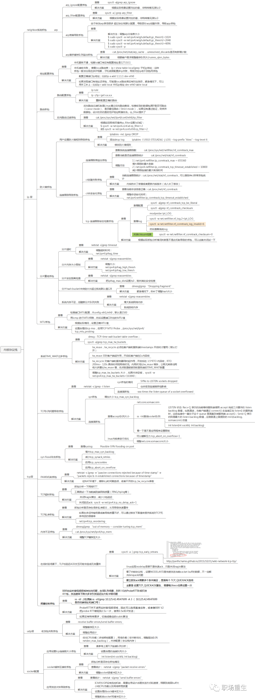


来自：

https://mp.weixin.qq.com/s/pQ8YNiRTpBE8BykhUv_mcg

https://blog.csdn.net/zgy666/article/details/104391160/